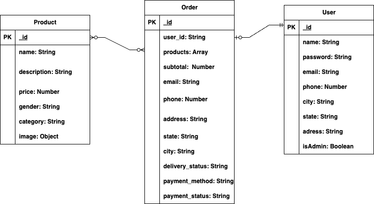

# Online Shop

Our online shop wants to build web app that serves as a platform to allow our customers to browse and purchase products of various categories from us. The app should provide an intuitive and seamless user experience, ensuring that customers can easily find and purchase the products they want. It should also allow our admin to create and manage our products, orders, transactions, and promotions.

## User Stories

### Guest Customer User

1. [ ] As a guest user, I can browse through the product catalog,
2. [ ] As a guest user, I can view product details
3. [ ] As a guest user, I can add products to my cart without registering.

### Registered Customer User

1. [ ] As a registered user, I can log in to the app,
2. [ ] As a registered user, I can browse through the product catalog,
3. [ ] As a registered user, I can view product details
4. [ ] As a registered user, I can add products to my cart.
5. [ ] As a registered user, I can check out securely.
6. [ ] As a registered user, I want to be able to track my orders and receive updates on their status.
7. [ ] As a registered user, I want to be able to check out my cart with Cash On Delivery payment options.

### Admin User

1. [ ] As an admin, I can register/sign in to my admin account.
2. [ ] As an admin, I can list my products on the marketplace.
3. [ ] As an admin, I can manage my product listings and update them as needed.
4. [ ] As an admin, I can receive and manage orders from buyers.
5. [ ] As an admin, I can communicate with buyers regarding their orders.

## Features and Specifications

### User Registration

1. [ ] Allow users to sign up, log in, and log out of the marketplace application with appropriate role.
2. [ ] Ensure that only authorized users have access to the appropriate features.
3. [ ] Use encryption to securely store user passwords and other sensitive information.

### Product Catalog & Search

1. [ ] Admin can create and manage (update, remove) product listings, including details such as title, description, price, and images.
2. [ ] Customers can search and browse for products based on keywords, categories, or other criteria.
3. [ ] Customers can view the product details (ex: description, stock quantity, discount if any,…)

### Cart Management & Checkout

1. [ ] Allow customers to add products to a cart, modify cart items, and proceed to checkout.
2. [ ] Provide a secure, user-friendly checkout process accepting COD payment methods.

### Order Management

1. [ ] Allow admin to receive order
2. [ ] Allow admin to update the delivery status of an order, which triggers automated notifications to be sent to the customers.
3. [ ] Customers can view their order history, track order status, and cancel orders (at the appropriate stage, for example before the order has been sent).

### Admin Dashboard

1. [ ] Admin can view key information such as product inventory, total registered customers, total revenue,…
2. [ ] Admin can view and filter total orders by status or other appropriate attributes.

## Endpoint APIs

### Auth APIs

```javascript
/**
 * @route POST /auth/login
 * @description Log in with email and password
 * @body { email, password }
 * @access Public
 */
```

### User APIs

```javascript
/**
 * @route POST /user/register
 * @description Register a new user
 * @body {name, email, password}
 * @access Public
```

```javascript
/**
 * @route GET /user/:userId
 * @description Get a user profile
 * @body { email, password }
 * @access Login required
```

### Cart APIs

```javascript
/**
 * @route GET /cart
 * @description Get all products in cart
 * @access Public
 */
```

```javascript
/**
 * @route GET /cart/checkout
 * @description Checkout cart
 * @access Public
 */
```

```javascript
/**
 * @route GET /cart/checkout/payment
 * @description Make payment
 * @access Public
 */
```

### Order APIs

```javascript
/**
 * @route POST /orders
 * @description Create an order
 * @body { userId, products, subtotal, total, shipping, delivery_status, payment_status }
 * @access Public
 */
```

```javascript
/**
 * @route PUT /orders
 * @description Update an order - Admin only
 * @body { userId, products, subtotal, total, shipping, delivery_status, payment_status }
 * @access Login required
 */
```

```javascript
/**
 * @route DELETE /orders
 * @description Delete an order - Admin only
 * @access Login required
 */
```

```javascript
/**
 * @route GET /orders
 * @description Get all orders
 * @access Login required
 */
```

```javascript
/**
 * @route GET /admin/orders/:userId
 * @description Get orders of a user
 * @access Login required
 */
```

```javascript
/**
 * @route GET /user/:userId/orders
 * @description Track a user orders
 * @access Login required
 */
```

### Product APIs

```javascript
/**
 * @route POST /admin/products/product
 * @description Create a product
 * @body { name, price, description , image }
 * @access Login required
 */
```

```javascript
/**
 * @route DELETE /admin/products/product
 * @description Delete a product
 * @access Login required
 */
```

```javascript
/**
 * @route PUT /admin/products/:productId
 * @description Update a product
 * @body { name, price, description , image }
 * @access Login required
 */
```

```javascript
/**
 * @route GET /products?page=1&limit=10
 * @description Get all products a user can see with pagination
 * @access Public
 */
```

```javascript
/**
 * @route GET /products/:productId
 * @description Get product detail
 * @access Public
 */
```


